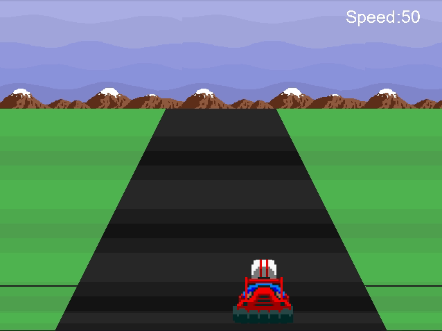

# Outrun like game

It is a P.O.C. of a 2D game made in C++ with GCC compiler and SDL2 libs.  

No one engine was used to create this. The sprites, tilesets and some
linear pixels was coded and using SDL as a renderer. 



# How to install

If you are using Debian linux, install the SDL2 libs running ```install-dsl.sh```.

On Windows OS, you could install the libs and compile using MinGW.

On the MacOS systems, you can install SDL libs using homebrew.


# How to compile

Just run ```sh compile.sh```, it invokes gcc compiler with the links and after the compilation,
it will execute the bin file.

